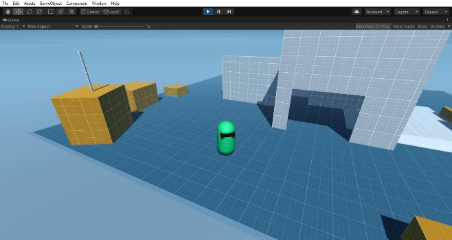
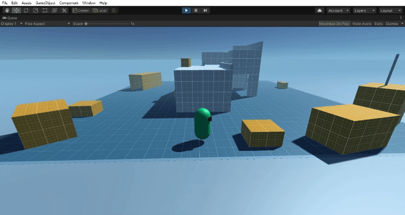
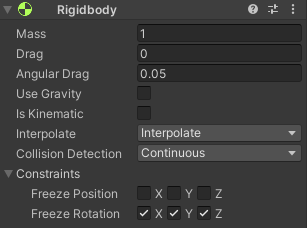

## 🏃‍♂️ TPMovement
**TPMovement** is a thrid person movement system for unity project.
There are two version of TPMovement, with `CharacterController` and with `Rigidbody`.
No animation implemented in script, and also still using unity's old input.
  
| Features | Control | Preview |
| --- | --- | --- |
| Basic Move | `WASD` |  |
| Run | `Left Shift` |  |
| Jump | `Space` |  |

## 🔗 Download
### Unity package download links:
- [TPMovement with CharacterController](https://github.com/vianagus/Unity-TPMovement/raw/main/_Unity%20Package/TPMovementWithCharacterController.unitypackage)
- [TPMovement with Rigodbody](https://github.com/vianagus/Unity-TPMovement/raw/main/_Unity%20Package/TPMovementWithRigidbody.unitypackage)

## ⚙ Installation
### TPMovement in general (with `CharacterController` and `Rigidbody`):
1. Download and import the unity package into unity project.
2. Create a `ground layer` if not already created.
3. Make sure to change the ground objects' layer into `ground layer`.
4. Put a `TPMovement Script` into player object.
5. Set `Ground Layer` attribute with the `ground layer`.

Make sure follow setting below if using **TPMovement with Rigidbody**.

## 🧩 Attributes
Adjust the following attributes to affect the movement.
| Attribute | Type  | Description |
| --- | --- | --- |
| `Move Speed` | float | speed of the basic move |
| `Run Speed` | float | speed of the run move |
| `Jump Height` | float | height of the jump |
| `Smooth Facing` | float | smooth character facing rotation |
| `Gravity Scale` | float | affect the jump and fall speed |
| `Ground Check Radius` | float | ground check radius range |
| `Ground Layer` | LayerMask | layer for ground check purpose |
